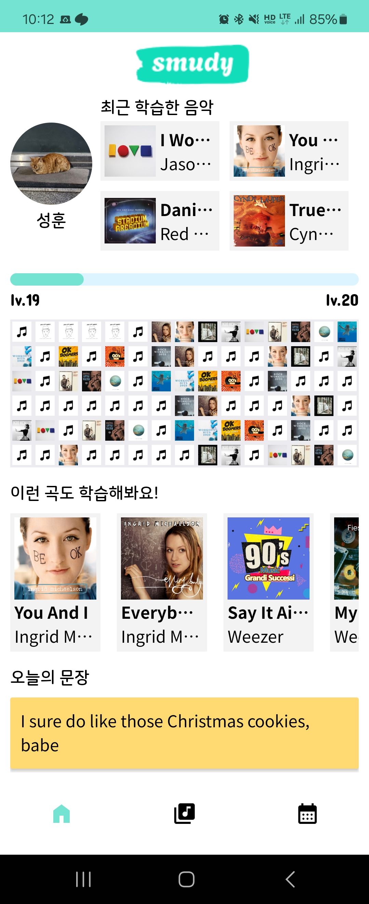
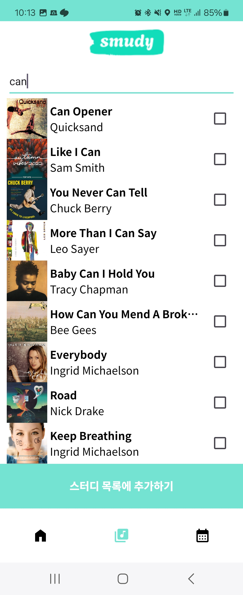
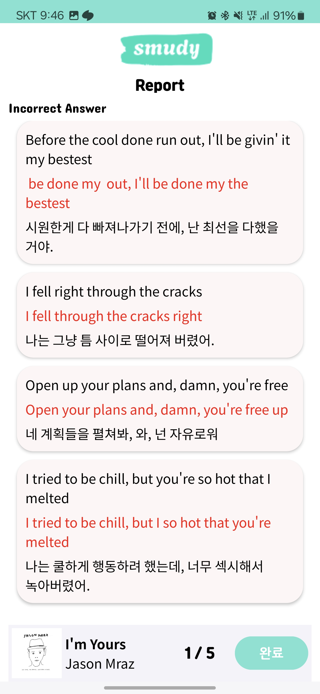
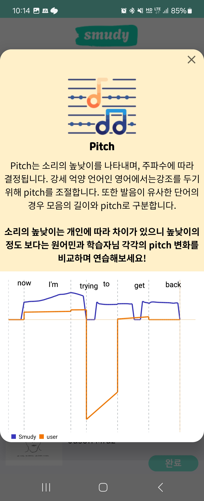

# SMUDY

### 팝송을 이용하여 영어 어휘 실력을 기르는 서비스

## 개발 환경
### Android
#### IDE
- Android Studio Iguana 2023.2.1 Patch 2
#### Version
- kotlin: 1.9.10
- JDK: jbr-17 jetbrains Runtime version 17.0.7
- SDK: 34
#### 📖 Android 라이브러리 및 외부 API 사용
| Library                        | Version   |
|--------------------------------|-----------|
| Core KTX                       | 1.13.0    |
| AppCompat                      | 1.6.1     |
| ViewModel KTX                  | 2.7.0     |
| ConstraintLayout               | 2.1.4     |
| Navigation Fragment KTX        | 2.7.7     |
| Navigation UI KTX              | 2.7.7     |
| RecyclerView                   | 1.3.2     |
| ViewPager2                     | 1.0.0     |
| Annotation                     | 1.7.1     |
| DataStore                      | 1.0.0     |
| SplashScreen                   | 1.0.0     |
| Material                       | 1.11.0    |
| Hilt                           | 2.48      |
| Hilt Navigation Fragment       | 1.2.0     |
| Retrofit                       | 2.9.0     |
| Moshi Converter                | 2.9.0     |
| Moshi Kotlin                   | 1.14.0    |
| OkHttp                         | 4.12.0    |
| Logging Interceptor            | 4.12.0    |
| Lottie                         | 6.4.0     |
| Glide                          | 4.16.0    |
| Circle ImageView               | 3.1.0     |
| MPAndroidChart                 | 3.1.0     |
| Kakao SDK                      | 2.20.1    |
| Calendar View                  | 2.5.0     |
| Flexbox                        | 3.0.0     |
| Dagger Hilt                    | 2.48      |
| Kotlin Parcelize               | 1.9.23    |
| Safe Args                      | 2.7.7     |
| KAPT                           | 1.8.0     |

## 서비스 소개
### 로그인

#### 로그인 페이지로 카카오 로그인으로 회원가입 및 로그인을 진행하는 페이지 입니다.
### 홈 화면

#### 홈 화면에서는 사용자 정보와 최근 학습한 음악, 레벨, 오늘부터 90일 동안의 학습 기록을 음악의 앨범 사진으로 확인할 수 있습니다. 또한, 학습 기록을 바탕으로 비슷한 노래들을 추천해 줍니다.

#### 오늘의 문장은 구축한 음악 데이터에서 무작위로 가사의 한 문장을 한글로 번역한 문장을 추천해주며, 이전에 공부했던 문장 중 틀렸던 부분을 영어와 한글로 복습할 수 있도록 합니다.
### 스터디 리스트

#### 첫 번째 이미지는 "나의 플레이리스트" 화면입니다. 이 화면에서는 사용자가 학습 중인 노래 목록이 표시됩니다. 노래는 앨범과 제목, 가수를 확인할 수 있고, 오른쪽 버튼을 통해 4가지 학습 유형으로 진입할 수 있습니다. 또한, 곡 추가를 통해 노래를 추가할 수 있는 페이지로 넘어갑니다.

#### 공부하고 싶은 노래를 검색할 수 있습니다. 이 때 단어를 입력하면 추천 검색어를 보여줍니다. 또한, 검색을 진행하면 해당 검색어와 관련된 검색 결과를 보여주고 선택하여 내 플레이리스트에 추가할 수 있습니다.
### FILL 유형

#### 가사 한 문장에 한 개의 빈칸이 있고, 노래를 들으며 해당 빈칸을 채우며 문제 풀이를 진행합니다. 또한, 빈칸에 제출한 단어의 채점 결과를 확인할 수 있습니다.
### PICK 유형

#### 선택한 노래의 가사 중 5문제가 출제되고, 해당 가사가 단어 단위로 섞이며 한국어로 번역된 문장을 보며 섞인 단어의 순서를 맞춥니다. 또한, 이렇게 푼 문제의 풀이 결과를 확인할 수 있습니다.
### EXPRESS 유형

#### 선택한 노래의 가사 중 5문제가 출제되고, 가사가 한국어로 번역되어 보여지고 영어로 표현해보는 유형입니다. 또한, 한 문제마다 채점 결과가 보여지고 마지막에 문제풀이 결과 전체를 확인할 수 있습니다.
### PRONOUNCE 유형

#### 선택한 노래의 가사 전체를 볼 수 있고 연습하고 있는 가사 하나를 선택해서 연습할 수 있습니다. 또한, 영어 발음을 들을 수 있고, 사용자가 녹음을 진행하고 다시 들을 수도 있습니다.

#### 발음 연습의 결과를 확인할 수 있는 페이지로 사용자가 녹음한 음성을 통해 ai가 어떻게 문장을 인식했는지 확인할 수 있고, pitch, intensity, formant를 확인할 수 있는 페이지로 넘어가는 버튼이 있습니다.

#### 사용자가 녹음한 음성을 분석한 결과들을 그래프를 통해 보여주는 페이지입니다.
### HISTORY

#### 그동안 공부했던 기록들을 확인할 수 있는 페이지로 월별로 공부한 날이 보이고, 날짜를 누르면 해당 날짜에 공부했던 노래와 공부 유형을 확인하고 결과 페이지로 이동할 수 있습니다. 결과 페이지의 정보는 4가지 유형의 공부 결과와 동일한 화면 입니다.
## 팀원 소개
